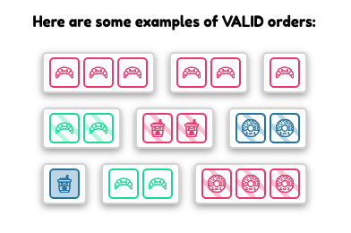
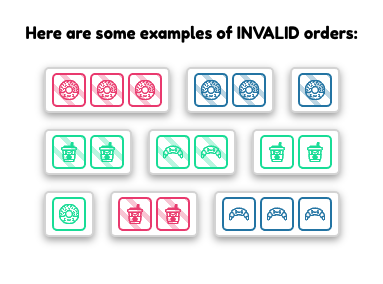
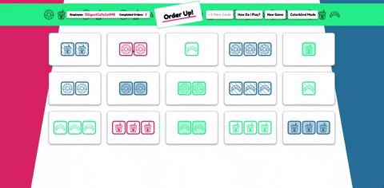

# Order Up!

Find the patterns and play with friends online! This is the front end of a
project to go with
[this backend.](https://github.com/dannyirwin/order-up-backend)

## Summary

Order Up is a clone of the popular game card game, Set. You are an employee of
an unusual cafe and have to trow together orders for customers. These orders,
represented by cards, have strict rules to them. Each card has 4 attributes:
Color, Fill/Shading, Number of items, and Item Type. A valid order consists of 3
cards where each attribute across the cards is either all teh same or all
different.

This is the first full backend I've built and it incorporates ActionCable to
support live online multiplayer via websockets.





## Technologies

&nbsp;&nbsp;&nbsp;&nbsp;&nbsp;&nbsp;&nbsp;&nbsp;&nbsp;&nbsp;&nbsp;&nbsp;&nbsp;&nbsp;&nbsp;
&nbsp;&nbsp;&nbsp;&nbsp;&nbsp;

## Features

- Full game cycle: Games persist over multiple sessions, can start new games,
  and handles all logic required to play.
- Online multiplayer updates across all users games when changes are made
- Colorblind Mode for accessability.

## Code Snippets

This code checks weather or not three cards are a valid set.

```javascript
const checkIsSet = cards => {
  const attributes = ['color', 'shape', 'fill', 'count'];

  for (let i in attributes) {
    const atr = attributes[i];
    const values = cards.map(card => card[atr]);

    const isAllSame = new Set(values).size === 1;
    const isAllUnique = new Set(values).size === values.length;

    if (!isAllSame(values) && !isAllUnique(values)) {
      return false;
    }
  }
  return true;
};
```

## Feature Wishlist

- While the app is currently deployed on Heroku, the there are still problems
  upgrading to websockets
- User Sign-in and authentication
- User can host a new game with a unique ID or us and ID to specify which game
  to join.
- In-game text chat.
- Store long term game data for leaderboards etc.

## Reach out

#### Want to get get in touch or see more of my work?

[Github Homepage](https://github.com/dannyirwin)

[Email Me](https://github.com/dannyirwin)

[Linkedin](https://www.linkedin.com/in/itsdanielirwin/)
